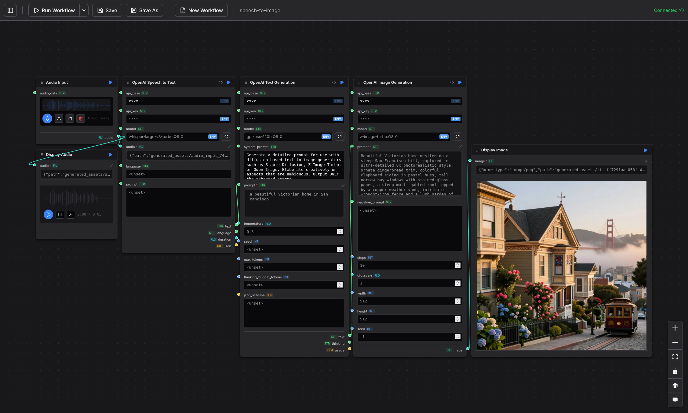

# flow

a visual, node-based workflow engine with native CLI integration
and user nodes in Python, Typescript, and Rhai

chain together LLMs, shell commands,
HTTP requests, scripts, web search, audio, and images by wiring up typed
nodes on a canvas. inspired by comfyui, written in rust with a react +
reactflow frontend.

build a graph, hit **run**, and flow walks the DAG, caches each node by
the hash of its inputs, streams partial output as it arrives, and shows
you exactly what every step produced.



## highlights

- **local-first, single binary.** `flow-server` is a self-contained rust
  binary that serves both the HTTP API and the UI (the react build is
  embedded at compile time via `rust-embed`). no telemetry, no cloud
  accounts, fully offline by default.
- **bring your own LLM.** talks to anything that speaks the openai HTTP
  API — `llama.cpp`, `llama-swap`, `ollama`, `vllm`, or the real openai.
  set `OPENAI_API_BASE` and the bundled LLM/STT/TTS/TTI nodes pick it up
  automatically.
- **content-addressed caching.** every node's output is hashed by its
  inputs and persisted to disk. re-running a workflow only re-executes
  the nodes that actually changed.
- **streaming output through the DAG.** long-running nodes (LLM
  generation, `ShellCommand`, HTTP SSE) emit partial output that
  propagates through downstream nodes and updates in the UI live.
- **two ways to drive it.**
  - **web UI** — drag-and-drop canvas with an interactive node browser,
    keyboard shortcuts, dark/light/system themes, a job queue, and
    inline result viewers (markdown, JSON, image, audio).
  - **`flow-cli`** — run any saved workflow from the command line, pipe
    stdin into a `Read` node, override input values with `--set`, or run
    a single node with `--node`.
- **hackable nodes.** drop a file into `user_nodes/` and flow picks it
  up on next start:
  - `.rhai` — rhai scripting (sandboxed, baked into the binary).
  - `.py` — full cpython via pyo3.
  - `.ts` — typescript via the embedded boa engine.
  - `.json` — declarative compositions of existing nodes, no code at all.

## builtin nodes

right out of the box you get:

| category   | nodes                                                                  |
|------------|------------------------------------------------------------------------|
| core       | `Echo`, `Read`, `RandomInteger`                                        |
| process    | `ShellCommand` (with stdin, streaming stdout, glob expansion)          |
| web / HTTP | `HttpRequest`, `WebFetch`, `WebSearch`, `HtmlToMarkdown`               |
| data       | `JsonQuery`, `Templatize`, `Join`, `Split`, `ListToJson`, `RegexpExtract`, `List` |
| display    | `DisplayMarkdown`, `DisplayJson`, `DisplayImage`, `DisplayAudio`, `AudioInput` |

the bundled scripted user nodes in [`user_nodes/`](user_nodes) add
openai-compatible LLM, TTS, STT, and text-to-image nodes (`OpenAI_LLM`,
`OpenAI_TTS`, `OpenAI_STT`, `OpenAI_TTI`), plus a `MeshtasticSend` python
node and a couple of declarative compositions (`SpeechToImage`,
`ShellToSpeech`).

every input on every node can be set via environment variable using the
auto-convention `FLOW_<NODE_TYPE>_<INPUT_NAME>` (all uppercase, special
characters replaced with underscores). some nodes also define shorter
explicit aliases — for example, the openai nodes accept `OPENAI_API_BASE`
and `OPENAI_API_KEY`.

resolution priority: **user-set value > `FLOW_<NODE>_<INPUT>` > alias env var > default.**

the more-specific auto-convention var always wins over a shared alias,
so you can set `OPENAI_API_BASE` globally and override a single node with
`FLOW_OPENAI_LLM_API_BASE`.

the openai nodes read environment variables at runtime — set these before
starting the server or CLI:

| variable           | purpose                                              | default                     |
|--------------------|------------------------------------------------------|-----------------------------|
| `OPENAI_API_BASE`  | base URL of any openai-compatible API server         | `https://api.openai.com/v1` |
| `OPENAI_API_KEY`   | bearer token sent with each request                  | *(empty)*                   |

when an env var is active, the UI shows a badge on the input field. values
set directly on the node always take priority over environment variables.

to list all available env vars:

```bash
cargo run --bin flow-cli -- env
```

both `flow-server` and `flow-cli` load a `.env` file from the current
directory on startup, so you can set these once instead of passing them
on every command:

```bash
# .env
OPENAI_API_BASE=http://localhost:8080/v1
OPENAI_API_KEY=sk-...
```

or pass them inline:

```bash
# use a local llama.cpp / llama-swap / ollama server
OPENAI_API_BASE=http://localhost:8080/v1 make start

# use the real openai API
OPENAI_API_BASE=https://api.openai.com/v1 OPENAI_API_KEY=sk-... make start
```

## installation

### prerequisites

- [rust](https://www.rust-lang.org/tools/install) (stable toolchain)
- [node.js](https://nodejs.org/) 16 or newer (for building the UI)
- *optional:* an openai-compatible HTTP endpoint if you want to run the
  bundled LLM / STT / TTS / TTI workflows. examples that work locally:
  [`llama.cpp`](https://github.com/ggml-org/llama.cpp),
  [`llama-swap`](https://github.com/mostlygeek/llama-swap),
  [`ollama`](https://ollama.com), `vllm`. point flow at it with
  `OPENAI_API_BASE`.
- *optional:* python 3 (for `.py` user nodes — enabled by default but
  can be turned off via cargo features).

### build

```bash
git clone https://github.com/khimaros/flow.git
cd flow
make build
```

`make build` runs `npm install && npm run build` in `ui/` and then
`cargo build --workspace`. the rust build embeds the freshly-built UI
into the server binary, so no extra static-file step is needed.

### run the web UI

```bash
make start
# or, with an LLM backend:
OPENAI_API_BASE=http://localhost:8080/v1 make start
```

then open <http://127.0.0.1:3000>.

`flow-server` accepts a few flags:

```bash
flow-server \
    --listen 127.0.0.1:3000 \
    --data-dir .              # where workflows/ and generated_assets/ live
```

### run a workflow from the CLI

```bash
# run a saved workflow (`run` is the default subcommand)
cargo run --bin flow-cli -- workflows/shell-pipes.json

# pipe stdin into a Read node
fortune | cargo run --bin flow-cli -- workflows/read-echo.json

# override an input value at the command line
cargo run --bin flow-cli -- workflows/text-to-speech.json \
    --set tts_input/text="hello from flow"

# run only one node from a workflow
cargo run --bin flow-cli -- workflows/haiku-echo.json openai_llm_xxxx

# suppress diagnostic output on stderr (machine-friendly)
cargo run --bin flow-cli -- -q workflows/uuid-echo.json

# inspect a workflow
cargo run --bin flow-cli -- nodes workflows/haiku-echo.json
cargo run --bin flow-cli -- handles workflows/haiku-echo.json    # all nodes
cargo run --bin flow-cli -- handles workflows/haiku-echo.json 'openai_*'

# lint workflows for inconsistencies; --fix to rewrite
cargo run --bin flow-cli -- lint
cargo run --bin flow-cli -- lint --fix

# cache management
cargo run --bin flow-cli -- cache stats          # add `workflows/` for live/stale
cargo run --bin flow-cli -- cache prune

# route stdin to a specific node input (default: all Read nodes)
echo "hello" | cargo run --bin flow-cli -- workflows/read-echo.json \
    --stdin read_node_id/input

# route a specific node output to stdout (default: terminal Echo nodes)
cargo run --bin flow-cli -- workflows/shell-pipes.json \
    --stdout shellcommand_abc/stdout

# combine for full pipeline composability
fortune | cargo run --bin flow-cli -- workflows/haiku-echo.json \
    --stdin read_xyz/input --stdout openai_llm_abc/response
```

## bundled workflows

the [`workflows/`](workflows) directory ships with a growing collection
of examples covering most of the builtin nodes. a few highlights:

| workflow            | what it shows                                                       |
|---------------------|---------------------------------------------------------------------|
| `shell-pipes`       | multi-stage shell pipelines built from `ShellCommand`, `Templatize`, `List`, and `Split`. |
| `shell-stream`      | streaming stdout from a long-running shell command rendered live in `DisplayMarkdown`. |
| `http-request`      | `HttpRequest` → `JsonQuery` → `Echo`, the canonical "talk to a JSON API" example. |
| `regexp-extract`    | pulling matches out of free-form text with `RegexpExtract`.         |
| `read-echo`         | stdin → `Read` → `Echo` — the smallest interactive flow.            |
| `uuid-echo`         | demonstrates a typescript user node (`UUID`) chained with `Echo`.   |
| `haiku-echo`        | LLM prompt → `JsonQuery` → `Echo`. needs an openai-compatible backend. |
| `fetch-summarize`   | web search → fetch → readability → LLM summary.                     |
| `text-to-speech`    | text input → openai-compatible TTS → `DisplayAudio`.                |
| `speech-to-image`   | microphone → STT → LLM rewrite → text-to-image → `DisplayImage`.    |
| `declarative-s2s`   | speech-to-speech pipeline assembled entirely from declarative JSON. |
| `stable-diffusion`  | random seed + prompt → text-to-image → `DisplayImage`.              |
| `mesh-quip`         | generate a one-liner with the LLM and broadcast it over meshtastic. |

workflows that hit an LLM/STT/TTS/TTI endpoint will pick up
`OPENAI_API_BASE` from the environment.

## editor cheat sheet

a few of the most-used keyboard shortcuts:

| action                            | binding                |
|-----------------------------------|------------------------|
| run current workflow              | `Ctrl+Shift+Enter`     |
| save / save as                    | `Ctrl+S`               |
| new workflow                      | `Ctrl+N`               |
| toggle sidebar                    | `B`                    |
| pan canvas                        | scroll / middle-drag / arrows |
| zoom canvas                       | `Ctrl+scroll`          |
| step through nodes                | `[` / `]`              |
| delete selected node              | `Delete` / `Backspace` |
| show full shortcut overlay        | `?`                    |

right-click the canvas to add a node, right-click a saved workflow in
the sidebar to rename or delete it, and drag from any node output handle
onto empty canvas to add a connected downstream node.

## writing your own nodes

drop a file into [`user_nodes/`](user_nodes) and restart the server. the
existing examples are the best starting point:

- `openai_llm.rhai` — full-featured rhai user node with streaming HTTP,
  inputs with `env_var` overrides, and dynamic option fetching.
- `meshtastic_send.py` — minimal python node showing the pyo3 surface.
- `uuid.ts` — a tiny typescript node.
- `speech_to_image.json` — a declarative composition that wires existing
  nodes together into a reusable unit, no code required.

see [CONTRIBUTING.md](CONTRIBUTING.md) for the node interface contract
and the architecture overview.

## project layout

```
src/                # rust backend
├── bin/            #   flow-server, flow-cli
├── nodes/          #   builtin node implementations
├── scripting/      #   rhai / python / typescript runtimes
├── engine.rs       #   DAG scheduler + result cache
├── graph.rs        #   workflow / node-instance types
├── node.rs         #   the Node trait
└── value.rs        #   dynamic Value type used on the wire

ui/                 # react + vite + reactflow frontend
                    # (built into the server binary via rust-embed)

workflows/          # bundled example workflows (.json)
user_nodes/         # bundled scripted / declarative user nodes
tests/              # API, CLI, and playwright UI end-to-end tests
```

## development

```bash
make build        # build server + UI
make start        # run flow-server on http://127.0.0.1:3000
make test         # run all e2e tests (API + CLI + UI)
make lint         # cargo clippy + ui eslint
make format       # cargo fmt + prettier + black
make precommit    # lint + test, run before pushing
```

see [CONTRIBUTING.md](CONTRIBUTING.md) for the full developer guide,
[ROADMAP.md](ROADMAP.md) for what's planned and what's done, and the
issue tracker for known bugs and feature requests.
